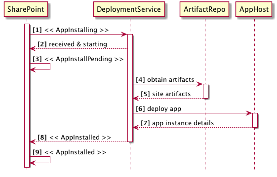

Overview
========
- quick look back
- introducing my proposal
- how it works
- parting thoughts


Quick Look Back
===============
at SharePoint 2013 RTM release SharePoint Apps existed in two forms

- SharePoint hosted
- cloud hosted


Cloud Hosted Apps
=================
###huge benefits!

- enabled external code
- enabled server-side code
- hosting on any infrastructure
- built using any technology


Cloud Hosted Apps
=================
###special requirements / challenges

- developers / providers responsible for external hosting
- developers / providers responsible for managing scale
- entrusted with customer data
- have to build with multi-tenant in mind (if a public app)


Autohosted Apps
===============
- Office 365 deploys the app for you
- each app installation gets:
  - a website 
  - a SQL Server database
  - is multi-tenant by default
- developer does not have to do anything special... just works!
- how? deployed and hosted using Microsoft Azure!


But Wait
========
###Autohosted Apps...
- can only be Azure Websites & Azure SQL Databases
  - *cannot leverage other parts of Microsoft Azure*
- only work in Office 365
  - *not available in on-premises SharePoint deployments*
- no visibility or control into the generated resources
- limited to ASP.NET technologies


Autohosted Apps
===============
###Discontinued May 2014
- Office 365 decided was not the path forward
- never made it out of preview
- guidance provided to migrate to provider hosted apps
- support removed from the tooling
- eventually will be removed from the platform


What Do We Need?
================
*we = customers, developers & Microsoft engineering *

- provider hosted apps are great for many scenarios
- developers need an easy way to deploy cloud hosted apps
- MSFT engineering does not need to boil the ocean for customers here
- give app developers / providers the power to control this


I Submit to You
===============

Automated App Deployment & Hosting (AAD[+H])
--------------------------------------------
*subject to marketing getting involved*


AAD+H Concepts
==============
- works same way in SharePoint Online & SharePoint On-Premises
- app packages includes an extra "widget"
- app installation routine uses this "widget" to:
  + partially install the app & leave in pending state
  + call a deployment service, passing along the "widget"
  + deployment service responds to SharePoint with deployment details
  + SharePoint completes app installation
- allow companies to opt-in / opt-out
- build for MVP, down the road improve with "added services"


Fixes Autohosted Shortcomings
=============================
- full control over the RemoteWeb URL
- use any hosting infrastructure
- use any implementation technology
- use the full suite of Microsoft Azure offerings
- works on-premises
- give customers control over the deployed instances


Process Flow Overview
=====================


(1) HTTPS POST that includes deployment data (*explained later*)

(4 & 5) includes RemoteWeb deployment packages (WebDeploy, BACKPAC, ZIP, etc.)

(6) uses **AppHost** APIs to stand up RemoteWeb & other stuff

(7) returns RemoteWeb details (ie: URL)

(8) returns details about RemoteWeb (ie: URL)

(9) updates app to **AppInstalled** pointing `App.StartPage = RemoteWeb.StartPage`


To Make this Work, We Need...
-----------------------------
- support for deployment service payload
  - similar to WorkflowManifest.xml, manifest within the *.app file
- dynamically set App.StartPage to a RemoteWeb.StartPage
- new event:
  - AppInstalling
- new state:
  - AppInstallPending
- event AppInstalling is an HTTPS POST with deployment service payload


AAD[+H] Roadmap
===============
###suggestions 

- P1 (MVP)
  - focus on SharePoint Online
  - simply make callouts & receive responses work
  - let customer build [DeploymentService]
  - ability to enable / disable at tenant scope
  - no tooling or UX updates
- P2
  - sample [DeploymentService] in [GitHub:OfficeDev](http://www.github.com/OfficeDev)
  - go public (blog, articles, etc)
  - tooling improvements
- P3
  - Office 365 tenant / SPSite / SPWeb administrations updates
  - Microsoft provided [DeploymentService] for Microsoft Azure
- P4
  - push OOTB to on-premises (vNext)


AAD[+H] In Detail
=================
- changes to app packages
- changes to SharePoint Online
- implementing the **DeploymentService**


(1 / 3) Changes to App Packages
-------------------------------
- need way for developer to communicate with deployment service
- suggestion: include DeploymentManifest.xml in *.app
- includes:
  - DeploymentServiceEndpoint (string): URL of deployment service
  - RemoteWebPackageUrl (string): URL of the WebDeploy package for the RemoteWeb
  - RemoteDbPackageUrl (string): URL of the *.DACPAC
  - Properties (nodes): name-value pairs used by DeploymentService


(2 / 3) Changes to SharePoint Online
------------------------------------
###upon starting app installation

- SPO puts app into state = AppInstallPending
- SPO submits HTTPS POST to DeploymentService
  - includes app installation detail
  - includes app DeploymentManifest.xml


(3 / 3) Deployment Service Endpoint Signature
---------------------------------------------
````c#
public interface IAppDeploymentServiceReceiver {
  public AppDeploymentServiceResult DeployApp(AppDeploymentManifest manifest, 
                                              AppProperties props) {
    var result = new AppDeploymentServiceResult();
    // set result
    return result;
  }
}

public class AppDeploymentServiceResult {
  public System.Net.HttpStatusCode StatusCode { get; set; }
  public string StatusMessage { get; set; }
  public Uri RemoteWebUrl { get; set; }
}

public class AppDeploymentManifest {
  public Uri RemoteWebPackageUrl { get; set; }
  public Uri RemoteDbPackageUrl { get; set; }
  public System.Collections.Dictionary DeploymentProperties { get; set; }
}

public class AppProperties {
  public System.Uri HostWebUrl { get; set; }
  public System.Uri AppWebUrl { get; set; }
  public Guid InstanceId { get; set; }
}
````


Wrapping It Up
==============
- brings back the ability to auto-host cloud apps
- puts control in the hands of the app developer
- empowers customer to pick their hosting deployment
- enables Microsoft to create an Azure deployment story

[](https://github.com/igrigorik/ga-beacon)
