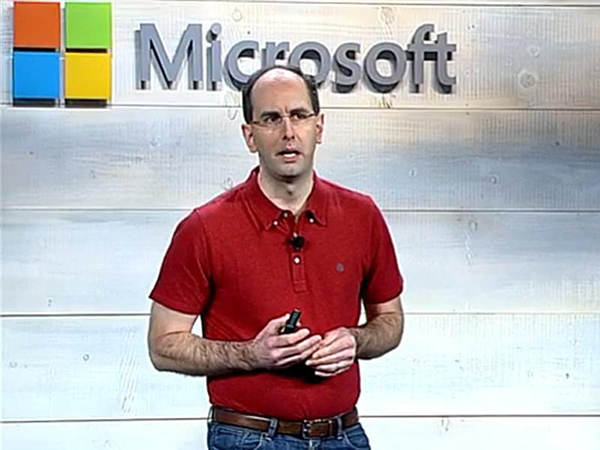

Overview
========
- quick look back <!-- .element: class="fragment" -->
- introducing my proposal <!-- .element: class="fragment" -->
- how it works <!-- .element: class="fragment" -->
- parting thoughts <!-- .element: class="fragment" -->


Before We Start...
==================
- I need everyone's attention <!-- .element: class="fragment" -->
- specifically the Microsoft engineering folks <!-- .element: class="fragment" -->
  - how do you do this? <!-- .element: class="fragment" -->
  - you seek out someone who's successful at this! <!-- .element: class="fragment" -->


Guy with Fairly Good Track Record
---------------------------------


Before We Start...
==================
- I need everyone's attention
- specifically the Microsoft engineering folks
  - how do you do this?
  - you seek out someone who's successful at this!
- shared my idea with my friend... <!-- .element: class="fragment" -->
- he liked it! <!-- .element: class="fragment" -->
- my friend made a huge suggestion to get Microsoft engineers' attention...  <!-- .element: class="fragment" -->


Before We Start...
==================
- I need everyone's attention
- specifically the Microsoft engineer folks
  - how do you do this?
  - you seek out someone who's successful at this!
- shared my idea with my friend...
- he liked it!
- my fiend made a huge suggestion to get Microsoft engineers' attention...

###Now do I have your attention? <!-- .element: class="fragment" -->


If you ever get this, you're golden
-----------------------------------


Quick Look Back
===============
at SharePoint 2013 RTM release SharePoint Apps existed in two forms

- SharePoint hosted <!-- .element: class="fragment" -->
- cloud hosted <!-- .element: class="fragment" -->


Cloud Hosted Apps
=================
###huge benefits! <!-- .element: class="fragment" -->

- enabled external code <!-- .element: class="fragment" -->
- enabled server-side code <!-- .element: class="fragment" -->
- hosting on any infrastructure <!-- .element: class="fragment" -->
- built using any technology <!-- .element: class="fragment" -->


Cloud Hosted Apps
=================
###special requirements / challenges

- developers / providers responsible for external hosting <!-- .element: class="fragment" -->
- developers / providers responsible for managing scale <!-- .element: class="fragment" -->
- entrusted with customer data <!-- .element: class="fragment" -->
- have to build with multi-tenant in mind (if a public app) <!-- .element: class="fragment" -->


Autohosted Apps
===============
- Office 365 deploys the app for you <!-- .element: class="fragment" -->
- each app installation gets: <!-- .element: class="fragment" -->
  - a website 
  - a SQL Server database
  - is multi-tenant by default
- developer does not have to do anything special... just works! <!-- .element: class="fragment" -->
- how? deployed and hosted using Microsoft Azure! <!-- .element: class="fragment" -->


Right People Happy
------------------


But Wait
========
###Autohosted Apps...
- can only be Azure Websites & Azure SQL Databases <!-- .element: class="fragment" -->
  - *cannot leverage other parts of Microsoft Azure*
- only work in Office 365 <!-- .element: class="fragment" -->
  - *not available in on-premises SharePoint deployments*
- no visibility or control into the generated resources <!-- .element: class="fragment" -->
- limited to ASP.NET technologies <!-- .element: class="fragment" -->


Wait... What?
-------------


Autohosted Apps
===============
###Discontinued May 2014
- Office 365 decided was not the path forward <!-- .element: class="fragment" -->
- never made it out of preview <!-- .element: class="fragment" -->
- guidance provided to migrate to provider hosted apps <!-- .element: class="fragment" -->
- support removed from the tooling <!-- .element: class="fragment" -->
- eventually will be removed from the platform <!-- .element: class="fragment" -->


Disappointment
==============



What Do We Need?
================
*we = customers, developers & Microsoft engineering *

- provider hosted apps are great for many scenarios <!-- .element: class="fragment" -->
- developers need an easy way to deploy cloud hosted apps <!-- .element: class="fragment" -->
- MSFT engineering does not need to boil the ocean for customers here <!-- .element: class="fragment" -->
- give app developers / providers the power to control this <!-- .element: class="fragment" -->


I Submit to You
===============
###...


Automated
=========

App <!-- .element: class="fragment" -->
=======================================

Deployment <!-- .element: class="fragment" -->
==============================================

& Hosting <!-- .element: class="fragment" -->
=============================================
###AAD[+H] <!-- .element: class="fragment" -->
*subject to marketing getting involved* <!-- .element: class="fragment" -->


AAD+H Concepts
==============
- works same way in SharePoint Online & SharePoint On-Premises <!-- .element: class="fragment" -->
- app packages includes an extra "widget" <!-- .element: class="fragment" -->
- app installation routine uses this "widget" to: <!-- .element: class="fragment" -->
  + partially install the app & leave in pending state <!-- .element: class="fragment" -->
  + call a deployment service, passing along the "widget" <!-- .element: class="fragment" -->
  + deployment service responds to SharePoint with deployment details <!-- .element: class="fragment" -->
  + SharePoint completes app installation <!-- .element: class="fragment" -->
- allow companies to opt-in / opt-out <!-- .element: class="fragment" -->
- build for MVP, down the road improve with "added services" <!-- .element: class="fragment" -->


Fixes Autohosted Shortcomings
=============================
- full control over the RemoteWeb URL <!-- .element: class="fragment" -->
- use any hosting infrastructure <!-- .element: class="fragment" -->
- use any implementation technology <!-- .element: class="fragment" -->
- use the full suite of Microsoft Azure offerings <!-- .element: class="fragment" -->
- works on-premises <!-- .element: class="fragment" -->
- give customers control over the deployed instances <!-- .element: class="fragment" -->


He Likes It
-----------


Process Flow Overview
=====================


(1) HTTPS POST that includes deployment data (*explained later*)

(4 & 5) includes RemoteWeb deployment packages (WebDeploy, BACKPAC, ZIP, etc.)

(6) uses **AppHost** APIs to stand up RemoteWeb & other stuff

(7) returns RemoteWeb details (ie: URL)

(8) returns details about RemoteWeb (ie: URL)

(9) updates app to **AppInstalled** pointing `App.StartPage = RemoteWeb.StartPage`


To Make this Work, We Need...
-----------------------------
- support for deployment service payload <!-- .element: class="fragment" -->
  - similar to WorkflowManifest.xml, manifest within the *.app file
- dynamically set App.StartPage to a RemoteWeb.StartPage <!-- .element: class="fragment" -->
- new event: <!-- .element: class="fragment" -->
  - AppInstalling
- new state: <!-- .element: class="fragment" -->
  - AppInstallPending
- event AppInstalling is an HTTPS POST with deployment service payload <!-- .element: class="fragment" -->


AAD[+H] Roadmap
===============
###suggestions 

- P1 (MVP) <!-- .element: class="fragment" -->
  - focus on SharePoint Online
  - simply make callouts & receive responses work
  - let customer build [DeploymentService]
  - ability to enable / disable at tenant scope
  - no tooling or UX updates
- P2 <!-- .element: class="fragment" -->
  - sample [DeploymentService] in [GitHub:OfficeDev](http://www.github.com/OfficeDev)
  - go public (blog, articles, etc)
  - tooling improvements
- P3 <!-- .element: class="fragment" -->
  - Office 365 tenant / SPSite / SPWeb administrations updates
  - Microsoft provided [DeploymentService] for Microsoft Azure
- P4 <!-- .element: class="fragment" -->
  - push OOTB to on-premises (vNext)


AAD[+H] In Detail
=================
- changes to app packages
- changes to SharePoint Online
- implementing the **DeploymentService**


(1 / 3) Changes to App Packages
-------------------------------
- need way for developer to communicate with deployment service <!-- .element: class="fragment" -->
- suggestion: include DeploymentManifest.xml in *.app <!-- .element: class="fragment" -->
- includes: <!-- .element: class="fragment" -->
  - DeploymentServiceEndpoint (string): URL of deployment service <!-- .element: class="fragment" -->
  - RemoteWebPackageUrl (string): URL of the WebDeploy package for the RemoteWeb <!-- .element: class="fragment" -->
  - RemoteDbPackageUrl (string): URL of the *.DACPAC <!-- .element: class="fragment" -->
  - Properties (nodes): name-value pairs used by DeploymentService <!-- .element: class="fragment" -->


(2 / 3) Changes to SharePoint Online
------------------------------------
###upon starting app installation

- SPO puts app into state = AppInstallPending <!-- .element: class="fragment" -->
- SPO submits HTTPS POST to DeploymentService <!-- .element: class="fragment" -->
  - includes app installation detail <!-- .element: class="fragment" -->
  - includes app DeploymentManifest.xml <!-- .element: class="fragment" -->


Deployment Service Endpoint Signature
-------------------------------------
````c#
public interface IAppDeploymentServiceReceiver {
  public AppDeploymentServiceResult DeployApp(AppDeploymentManifest manifest, 
                                              AppProperties props) {
    var result = new AppDeploymentServiceResult();
    // set result
    return result;
  }
}

public class AppDeploymentServiceResult {
  public System.Net.HttpStatusCode StatusCode { get; set; }
  public string StatusMessage { get; set; }
  public Uri RemoteWebUrl { get; set; }
}

public class AppDeploymentManifest {
  public Uri RemoteWebPackageUrl { get; set; }
  public Uri RemoteDbPackageUrl { get; set; }
  public System.Collections.Dictionary DeploymentProperties { get; set; }
}

public class AppProperties {
  public System.Uri HostWebUrl { get; set; }
  public System.Uri AppWebUrl { get; set; }
  public Guid InstanceId { get; set; }
}
````


Wrapping It Up
==============
- brings back the ability to auto-host cloud apps <!-- .element: class="fragment" -->
- puts control in the hands of the app developer <!-- .element: class="fragment" -->
- empowers customer to pick their hosting deployment <!-- .element: class="fragment" -->
- enables Microsoft to create an Azure deployment story <!-- .element: class="fragment" -->


This could Sell more Office 365!
================================


Makes him Happy!
----------------


This could Sell more Microsoft Azure!
=====================================


Makes him Happy!
----------------


This Could Be Big!
==================


And Now I've Gone Too Far
-------------------------

